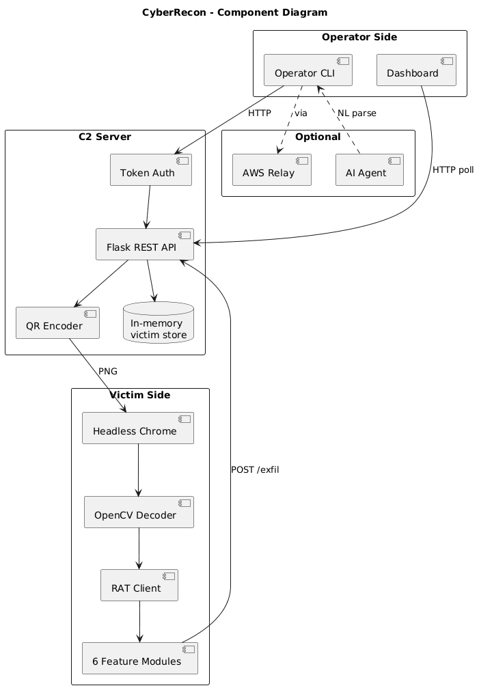
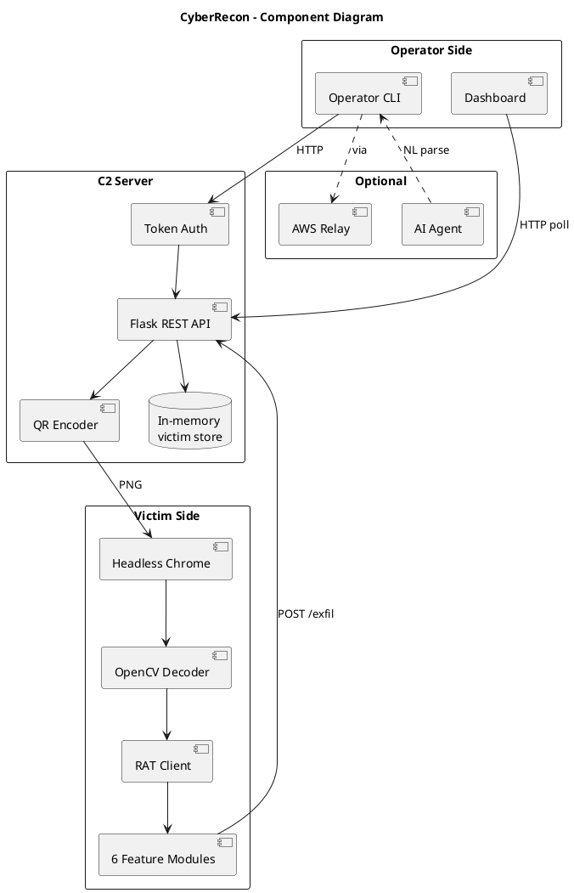

# CyberRecon — Component Diagram

**Format:** PlantUML

**Source file:** [architecture-components.puml](architecture-components.puml)

## Rendered Diagram

## PlantUML Source

```plantuml
@startuml
skinparam packageStyle rectangle
title CyberRecon - Component Diagram

package "Operator Side" {
    [Operator CLI] as CLI
    [Dashboard] as DASH
}

package "C2 Server" {
    [Flask REST API] as API
    [QR Encoder] as QR
    database "In-memory\nvictim store" as STORE
    [Token Auth] as AUTH
}

package "Victim Side" {
    [RAT Client] as RAT
    [Headless Chrome] as BROWSER
    [OpenCV Decoder] as DECODER
    [6 Feature Modules] as MODULES
}

package "Optional" {
    [AWS Relay] as RELAY
    [AI Agent] as AI
}

CLI --> AUTH : HTTP
DASH --> API : HTTP poll
AUTH --> API
API --> STORE
API --> QR
QR --> BROWSER : PNG
BROWSER --> DECODER
DECODER --> RAT
RAT --> MODULES
MODULES --> API : POST /exfil
CLI ..> RELAY : via
AI ..> CLI : NL parse

@enduml
```